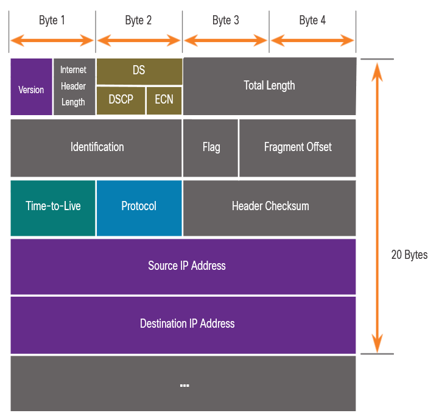
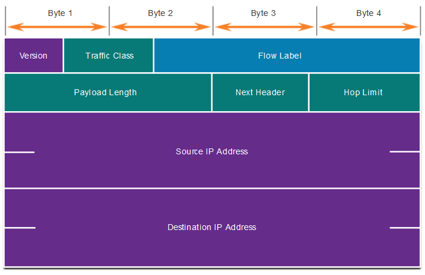

# Capa de Red

## Características de la capa de red

Proporciona servicios para permitir que los dispositivos finales intercambien datos

IP versión 4 (IPv4) e IP versión 6 (IPv6) son los principales protocolos de comunicación de la capa de red.

La capa de red realiza cuatro operaciones básicas:
- Direccionamiento de terminales
- Encapsulamiento
- Routing
- Desencapsulamiento

### Encapsulación IP

Caracteristicas de encapsulación:

- IP encapsula el segmento de la capa de transporte.
- IP puede utilizar un paquete IPv4 o IPv6 y no afectar al segmento de capa 4.
- El paquete IP será examinado por todos los dispositivos de capa 3 a medida que atraviese la red.
- El direccionamiento IP no cambia de origen a destino.

> Nota: NAT cambiará el direccionamiento, pero se discutirá en un módulo posterior. 

### Sin conexión (Connectionless)

IP Sin conexión (Connectionless) 

- IP no establece ninguna conexión con el destino antes de enviar el paquete.
- No se necesita información de control (sincronizaciones, confirmaciones, etc.).
- El destino recibirá el paquete cuando llegue, pero no se envían notificaciones previas por IP.
- Si hay una necesidad de tráfico orientado a la conexión, otro protocolo manejará esto (normalmente TCP en la capa de transporte).

### Independencia de Medios

IP no es confiable:  

- No puede administrar ni corregir paquetes no entregados o corruptos.
- IP no puede retransmitir después de un error.
- IP no puede realinear los paquetes de secuencia.
- IP debe depender de otros protocolos para estas funciones.

IP es independiente de los medios:

- IP no se refiere al tipo de trama requerido en la capa de enlace de datos ni al tipo de medio en la capa física.
- IP se puede enviar a través de cualquier tipo de medio: cobre, fibra o inalámbrica.

La capa de red establecerá la Unidad de Transmisión Máxima (MTU).

- La capa de red lo recibe de la información de control enviada por la capa de vínculo de datos.
- A continuación, la red establece el tamaño de MTU.

La fragmentación es cuando la Capa 3 divide el paquete IPv4 en unidades más pequeñas.

- Fragmentar provoca latencia.
- IPv6 no fragmenta paquetes.
- Ejemplo: El router pasa de Ethernet a una WAN lenta con una MTU más pequeña.

##  Paquete IPv4

IPv4 es el protocolo de comunicación principal para la capa de red.

El encabezado de red tiene muchos propósitos:

- Garantiza que el paquete se envía en la dirección correcta (al destino).
- Contiene información para el procesamiento de capas de red en varios campos.
- La información del encabezado es utilizada por todos los dispositivos de capa 3 que manejan el paquete

### Campos de encabezado de paquete IPV4

Campos significativos en el encabezado IPv4:

| Función | Descripción |
|:---|:---|
| Versión                   | Esto será para v4, a diferencia de v6, un campo de 4 bits = 0100  |
| Servicios diferenciados   | Utilizado para QoS: campo DiffServ — DS o el anterior IntServ — ToS o Tipo de servicio |
| Suma de comprobación del encabezado   | Detectar daños en el encabezado IPv4 |
| Tiempo de vida (TTL)      | Recuento de saltos de capa 3. Cuando se convierte en cero, el router descartará el paquete. |
| de internet               |  Protocolo de siguiente nivel de ID: ICMP, TCP, UDP, etc. |
| Dirección IPv4 de origen  | Dirección de origen de 32 bits |
| Dirección IPv4 de destino | Dirección de destino de 32 bits |

## Paquetes IPv6

IPv6 fué desarrollado por Internet Engineering Task Force (IETF). IPv6 vence las limitaciones de IPv4.

Mejoras que proporciona IPv6:

- Mayor espacio de direcciones: basado en la dirección de 128 bits, no en 32 bits
- Manejo mejorado de paquetes: encabezado simplificado con menos campos
- Elimina la necesidad de NAT: dado que hay una gran cantidad de direccionamiento, no es necesario utilizar direccionamiento privado internamente y asignarse a una dirección pública compartida

### Campos de encabezado de paquetes IPv4 en el encabezado de paquetes IPv6

- El encabezado IPv6 se simplifica, pero no es más pequeño.
- El encabezado se fija en 40 Bytes u octetos de longitud.
- Se eliminaron varios campos IPv4 para mejorar el rendimiento.
- Algunos campos IPv4 se eliminaron para mejorar el rendimiento:
  - Señalador
  - Desplazamiento de fragmentos
  - Suma de comprobación del encabezado.

### Encabezado de paquetes IPv6

| Función | Descripción |
|:---|:---|
| Versión                   | Esto será para v6, a diferencia de v4, un campo de 4 bits = 0110   |
| Clase de tráfico          | Utilizado para QoS: Equivalente al campo DiffServ — DS  |
| Etiqueta de flujo         | Informa al dispositivo para manejar etiquetas de flujo idénticas de la misma manera, campo de 20 bits |
| Longitud de carga útil    | Este campo de 16 bits indica la longitud de la porción de datos o la carga útil del paquete IPv6 |
| Siguiente encabezado      |  I.D.s de siguiente nivel protocolo: ICMP, TCP, UDP, etc. |
| Dirección IPv6 de origen  | Dirección de origen de 128 bits |
| Dirección IPv6 de destino | Dirección de destino de 128 bits |

## Cómo se enruta un host

### decisión de reenvío

El dispositivo de origen determina si el destino es local o remoto

Método de determinación:

- IPv4: el origen utiliza su propia dirección IP y máscara de subred, junto con la dirección IP de destino
- IPv6: el origen utiliza la dirección de red y el prefijo anunciados por el enrutador local

El tráfico local se desconecta de la interfaz de host para ser manejado por un dispositivo intermediario.

El tráfico remoto se reenvía directamente a la puerta de enlace predeterminada de la LAN.

### Gateway y Predeterminado

Un enrutador o conmutador de capa 3 puede ser una puerta de enlace predeterminada.

Características de una puerta de enlace predeterminada (DGW):

- Debe tener una dirección IP en el mismo rango que el resto de la LAN.
- Puede aceptar datos de la LAN y es capaz de reenviar tráfico fuera de la LAN.
- Puede enrutarse a otras redes.

Si un dispositivo no tiene una puerta de enlace predeterminada o una puerta de enlace predeterminada incorrecta, su tráfico no podrá salir de la LAN.

## Introducción al enrutamiento

Hay tres tipos de rutas en la tabla de enrutamiento de un enrutador:

- Conectado directamente: Estas rutas son agregadas automáticamente por el router, siempre que la interfaz esté activa y tenga direccionamiento. 
- Remoto: Estas son las rutas que el router no tiene una conexión directa y se pueden aprender:
  - Manualmente: con una ruta estática
  - Dinámicamente: mediante el uso de un protocolo de enrutamiento para que los routers compartan su información entre sí
- Ruta predeterminada: reenvía todo el tráfico a una dirección específica cuando no hay coincidencia en la tabla de enrutamiento 

### Enrutamiento estático

Características de la ruta estática:

- Debe configurarse manualmente.
- Debe ser ajustado manualmente por el administrador cuando hay un cambio en la topología
- Bueno para redes pequeñas no redundantes
- Se utiliza a menudo junto con un protocolo de enrutamiento dinámico para configurar una ruta predeterminada

Ejemplo:

  # sintaxis: orden ip-destino mascara-red-destino por-donde-enviar IP|interfaz
  R1(config)# ip route 10.1.1.0 255.255.255.0 209.165.200.226
  R1(config)# ip route 10.1.1.0 255.255.255.0 gigabitEthernet 0/0
  R1# show ip route

### Enrutamiento dinámico

Rutas dinámicas automáticamente:

- Detectar redes remotas.
- Mantener información actualizada.
- Elija el mejor camino hacia las redes de destino
- Buscar nuevas rutas óptimas cuando hay un cambio de topología

> El enrutamiento dinámico también puede compartir rutas estáticas predeterminadas con los otros routers.

