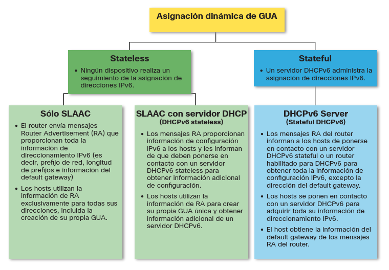

# SLAAC y DHCPv6

## Asignación de GUA IPv6

De forma predeterminada, un enrutador habilitado para IPv6 envía periódicamente RA ICMPv6, lo que simplifica la forma en que un host puede crear o adquirir dinámicamente su configuración IPv6.

### tres indicadores de mensaje RA

La forma en que un cliente obtiene un GUA IPv6 depende de la configuración del mensaje RA.

Un mensaje de ICMPv6 RA incluye los tres indicadores siguientes:

- Un indicador (flag): el indicador de configuración automática de direcciones significa utilizar la configuración automática de direcciones sin estado (SLAAC) para crear un GUA de IPv6
- El Indicador 0 (flag O)- El otro indicador de configuración se utiliza para informarle al cliente que hay información adicional disponible de un servidor de DHCPv6 stateless.
- Indicador M : el indicador Configuración de dirección administrada significa usar un servidor DHCPv6 con estado para obtener una GUA IPv6. 

### formas de direccionamiento

SLAAC: Toda la información la proporciona el router - Prefijo de red y puerta de enlace.

SLAAC + DHCP: el router proporciona Prefijo de red y puerta de enlace, e indica que a de buscar en la red un DHCP para la información complementaria.

DHCP Statefull: El router proporciona Puerta de enlace y el DHCP proporciona: prefijo, red, información complementaria y hace seguimiento de irecciones asignadas.

## SLAAC

No todas las redes tienen acceso a un servidor DHCPv6, pero todos los dispositivos de una red IPv6 necesitan un GUA. El método SLAAC permite a los hosts crear su propia dirección única global IPv6 sin los servicios de un servidor DHCPv6.

SLAAC es un servicio sin estado, lo que significa que no hay ningún servidor que mantenga información de direcciones de red para saber qué direcciones IPv6 se están utilizando y cuáles están disponibles.

SLAAC envía mensajes periódicos de RA ICMPv6 (es decir, cada 200 segundos) proporcionando direcciones y otra información de configuración para que los hosts configuren automáticamente su dirección IPv6 en función de la información del RA.

Un host también puede enviar un mensaje de solicitud de enrutador (RS) solicitando una RA.

SLAAC sólo se puede implementar como SLAAC, o SLAAC con DHCPv6.

### Activación de SLAAC

Para la activación dew SLAAC en un router se tiene que añadir una ipv6 en alguna interfaz y añadir la orden `ipv6 unicast-routing` para empezar a mandar mensajes RA cada 200 segundos.

Automaticamente el router se añadira a las redes:

    ff02::1 --> Grupo de todos los nodos IPv6  donde se envia RA
    ff02::2 --> El grupo de todos los routers IPv6  responde a RS

## DHCPv6

### Pasos de operación DHCPv6

DHCPv6 Statefull no requiere SLAAC mientras que DHCPv6 sin estado lo hace.

Sin embargo, cuando un RA indica que debe usar DHCPv6 o DHCPv6 con estado:

1. El host envía un mensaje RS.
2. El router responde con un mensaje RA.
3. El host envía un mensaje DHCPv6 SOLIT.
4. El servidor DHCPv6 responde con un mensaje ADVERTISE.
5. El host responde al servidor DHCPv6.
6. El servidor DHCPv6 envía un mensaje de respuesta.

> Nota: Los mensajes DHCPv6 de servidor a cliente utilizan el puerto de destino UDP 546, mientras que los mensajes DHCPv6 de cliente a servidor utilizan el puerto de destino UDP 547. 

### Operación DHCPv6 sin estado 

Si un RA indica el método DHCPv6 sin estado, el host utiliza la información del mensaje RA para direccionamiento y se pone en contacto con un servidor DHCPv6 para obtener información adicional.

> Nota: El servidor DHCPv6 sólo proporciona parámetros de configuración para clientes y no mantiene una lista de enlaces de direcciones IPv6 (es decir, sin estado). 

Por ejemplo, PC1 recibe un mensaje de RA sin estado que contiene:

- El prefijo de red IPv6 GUA y la longitud del prefijo.
- Un indicador establecido en 1 que informa al host de usar SLAAC.
- Indicador O establecido en 1 para informar al host que busque esa información de configuración adicional de un servidor DHCPv6.
- Indicador M establecido en el valor predeterminado 0.
- PC1 envía un mensaje DHCPv6 SOLCIT buscando información adicional de un servidor DHCPv6 sin estado.

### Habilitar DHCPv6 sin estado en una interfaz

DHCPv6 sin estado está habilitado mediante el comando de configuración de interfaz `ipv6 nd other-config-flag` estableciendo el indicador O en 1.

### Habilitar DHCPv6 con estado en una interfaz

DHCPv6 con estado está habilitado mediante el comando de configuración de interfaz `ipv6 nd managed-config-flag`, estableciendo el indicador M en 1.

## Configurar el servidor DHCPv6

Los routers IOS de Cisco son dispositivos potentes. En redes más pequeñas, no es necesario tener dispositivos separados para tener un servidor DHCPv6, un cliente o un agente de retransmisión. Se puede configurar un router Cisco para proporcionar servicios DHCPv6.

Específicamente, se puede configurar para que sea uno de los siguientes:

- Servidor DHCPv6 - Router proporciona servicios DHCPv6 sin estado o con estado. 
- Cliente DHCPv6 : la interfaz del enrutador adquiere una configuración IP IPv6 de un servidor DHCPv6. 
- Agente de retransmisión DHCPv6 - Router proporciona servicios de reenvío DHCPv6 cuando el cliente y el servidor se encuentran en diferentes redes. 

### Configurar un servidor DHCPv6 sin estado

La opción de servidor DHCPv6 sin estado requiere que el enrutador anuncie la información de direccionamiento de red IPv6 en los mensajes RA.

Hay cinco pasos para configurar y verificar un enrutador como servidor DHCPv6 sin estado:

- Habilite el routing IPv6 en el R1 por medio del comando IPv6 `unicast-routing`.
- Defina un nombre de grupo DHCPv6 mediante el comando `ipv6 dhcp poolPOOL-NAME` global config. 
- Configure el grupo DHCPv6 con opciones. Las opciones comunes incluyen `dns-server X:X:X:X:X:X:X:X` y nombre de dominio .
- Enlazar la interfaz al grupo mediante el comando `ipv6 dhcp server POOL-NAME` interface config. 
- Compruebe que los hosts han recibido información de direccionamiento IPv6 mediante el comando `ipconfig /all` .

    R1(config)# ipv6 unicast-routing
    R1(config)# ipv6 dhcp pool IPV6-STATELESS

    R1(config-dhcpv6)# dns-server 2001:db8:acad:1::254
    R1(config-dhcpv6)# domain-name example.com
    R1(config-dhcpv6)# exit

    R1(config)# interface GigabitEthernet0/0/1
    R1(config-if)# description Link to LAN
    R1(config-if)# ipv6 address fe80::1 link-local
    R1(config-if)# ipv6 address 2001:db8:acad:1::1/64
    R1(config-if)# ipv6 nd other-config-flag
    R1(config-if)# ipv6 dhcp server IPV6-STATELESS
    R1(config-if)# no shut

### Configurar un cliente DHCPv6 sin estado

Un enrutador también puede ser un cliente DHCPv6 y obtener una configuración IPv6 de un servidor DHCPv6, como un enrutador que funcione como servidor DHCPv6.

- Habilite el routing IPv6 en el R1 por medio del comando IPv6 `unicast-routing`.
- Configure el enrutador cliente para crear una LLA. Una dirección local de vínculo IPv6 se crea en una interfaz de enrutador cuando se configura una dirección de unidifusión global, o sin una GUA mediante el comando de configuración de intefaz ipv6 enable . Cisco IOS utiliza EUI-64 para crear el ID de interfaz.
- Configure el enrutador cliente para que utilice SLAAC mediante el comando `ipv6 address autoconfig` .
- Compruebe que el router cliente tiene asignado un GUA mediante el comando `show ipv6 interface brief` .
- Verifique que el enrutador cliente haya recibido otra información DHCPv6 necesaria. El comando `show ipv6 dhcp interface g0/0/1` confirma que el cliente ha recibido información de opciones DHCP, como el servidor DNS y el nombre de dominio.

    R3(config)# ipv6 unicast-routing

    R3(config)# interface g0/0/1
    R3(config-if)# ipv6 enable

    R3(config-if)# ipv6 address autoconfig

    R3# show ipv6 interface brief
    R3# show ipv6 dhcp interface g0/0/1

### Configurar un servidor DHCPv6 con estado

La opción de servidor DHCP con estado requiere que el enrutador habilitado para IPv6 indique al host que se ponga en contacto con un servidor DHCPv6 para obtener toda la información de direccionamiento de red IPv6 necesaria.

Hay cinco pasos para configurar y verificar un enrutador como un servidor DHCPv6 con estado:

- Habilite el routing IPv6 en el R1 por medio del comando `IPv6 unicast-routing`.
- Defina un nombre de grupo DHCPv6 mediante el comando `ipv6 dhcp poolPOOL-NAME` global config. 
- Configure el grupo DHCPv6 con opciones. Las opciones comunes incluyen el comando address prefix , el nombre de dominio, la dirección IP del servidor DHS y más.
- Enlazar la interfaz al grupo mediante el comando `ipv6 dhcp server POOL-NAME` interface config. 
- Compruebe que los hosts han recibido información de direccionamiento IPv6 mediante el comando `ipconfig /all` .

    R1(config)# ipv6 unicast-routing
    R1(config)# ipv6 dhcp pool IPV6-STATEFUL

    R1(config-dhcpv6)# address prefix 2001:db8:acad:1::/64
    R1(config-dhcpv6)# dns-server 2001:4860:4860: :8888
    R1(config-dhcpv6)# domain-name example.com

    R1(config)# interface GigabitEthernet0/0/1
    R1(config-if)# description Link to LAN
    R1(config-if)# ipv6 address fe80::1 link-local
    R1(config-if)# ipv6 address 2001:db8:acad:1::1/64
    R1(config-if)# ipv6 nd managed-config-flag
    R1(config-if)# ipv6 nd prefix default no-autoconfig
    R1(config-if)# ipv6 dhcp server IPV6-STATEFUL
    R1(config-if)# no shut

### Configurar un cliente DHCPv6 con estado

Un router también puede ser un cliente DHCPv6. El enrutador cliente debe tener habilitado el enrutamiento unicast-routing ipv6 y una dirección local de enlace IPv6 para enviar y recibir mensajes IPv6.

Hay cinco pasos para configurar y verificar un enrutador como cliente DHCPv6 sin estado.

- Habilite el routing IPv6 en el R1 por medio del comando `IPv6 unicast-routing`.
- Configure el router cliente para crear una LLA. Una dirección local de vínculo IPv6 se crea en una interfaz de enrutador cuando se configura una dirección de unidifusión global, o sin una GUA mediante el comando de configuración de interfaz `ipv6 enable`. Cisco IOS utiliza EUI-64 para crear un ID de interfaz.
- Configure el enrutador cliente para que utilice DHCPv6 mediante el comando `ipv6 address dhcp` interface config.
- Compruebe que el router cliente tiene asignado un GUA mediante el comando `show ipv6 interface brief` . 
- Compruebe que el router cliente recibió otra información DHCPv6 necesaria mediante el comando `show ipv6 dhcp interface g0/0/1` . 

    R3(config)# ipv6 unicast-routing

    R3(config)# interface g0/0/1
    R3(config-if)# ipv6 enable
    R3(config-if)# ipv6 address dhcp

    R3# show ipv6 interface brief
    R3# show ipv6 dhcp interface g0/0/1

### Configurar un agente de retransmisión DHCPv6

Si el servidor de DHCPv6 está ubicado en una red distinta de la del cliente, el router IPv6 puede configurarse como agente de retransmisión DHCPv6. 

- La configuración de un agente de retransmisión DHCPv6 es similar a la configuración de un router IPv4 
como retransmisor DHCPv4.
- Este comando se configura en la interfaz que enfrenta a los clientes DHCPv6 y especifica la dirección del servidor DHCPv6 y la interfaz de salida para llegar al servidor, como se muestra en la salida. La interfaz de salida sólo es necesaria cuando la dirección de salto siguiente es una LLA.

    Router(config-if)# ipv6 dhcp relay destination ipv6-address [interface-type interface-number]

    R1(config)# interface gigabitethernet 0/0/1
    R1(config-if)# ipv6 dhcp relay destination 2001:db8:acad:1::2 G0/0/0
    R1(config-if)# exit

