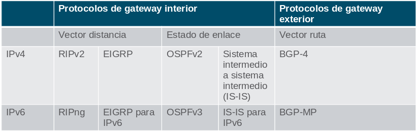

# Conceptos de enrutamiento

## Determinación de Ruta

### Mejor ruta es igual a la coincidencia más larga

La mejor ruta de la tabla de enrutamiento también se conoce como la coincidencia más larga.

La tabla de enrutamiento contiene entradas de ruta que consisten en un prefijo (dirección de red) y una longitud de prefijo. Para que haya una coincidencia entre la dirección IPv4 de destino de un paquete y una ruta en la tabla de enrutamiento, una cantidad mínima de los bits del extremo izquierdo deben coincidir entre la dirección IPv4 del paquete y la ruta en la tabla de routing. La máscara de subred de la ruta en la tabla de enrutamiento se utiliza para determinar la cantidad mínima de bits del extremo izquierdo que deben coincidir. 

La mejor coincidencia es la ruta de la tabla de enrutamiento que contiene la mayor cantidad de bits del extremo izquierdo coincidentes con la dirección IPv4 de destino del paquete. La coincidencia más larga es la ruta preferida.

> Nota: El término longitud del prefijo se utilizará para hacer referencia a la parte de red de direcciones IPv4 e IPv6. 

#### ejemplo

Un paquete IPv4 tiene la dirección IPv4 de destino 172.16.0.10. 
El router tiene tres rutas posibles que coinciden con este paquete: 172.16.0.0/12, 172.16.0.0/18 y 172.16.0.0/26. 
De las tres rutas, 172.16.0.0/26 tiene la coincidencia más larga y se elige para reenviar el paquete. 
Recuerde que para que cualquiera de estas rutas se considere una coincidencia debe tener al menos la cantidad de bits que se indica en la máscara de subred de la ruta.

### Generar la Tabla de Enrutamiento

**Redes conectadas directamente:** se agregan a la tabla de enrutamiento cuando una interfaz local está configurada con una dirección IP y una máscara de subred (longitud de prefijo) y está activa (arriba y arriba). 

**Redes remotas**: redes que no están conectadas directamente al router. Un router descubre redes remotas de dos maneras:

- **Rutas estáticas:** se agrega a la tabla de enrutamiento cuando se configura manualmente una ruta. 
- **Protocolos de enrutamiento dinámico:** se han añadido a la tabla de enrutamiento cuando los protocolos de enrutamiento aprenden dinámicamente acerca de la red remota.  

**Ruta predeterminada:** específica un router de salto siguiente que se utilizará cuando la tabla de enrutamiento no contiene una ruta específica que coincida con la dirección IP de destino. Una ruta predeterminada puede ser una ruta estática o aprenderse automáticamente de un protocolo de enrutamiento dinámico.

Una ruta predeterminada tiene una longitud de prefijo /0. Esto significa que no es necesario que los bits coincidan con la dirección IP de destino para que se utilice esta entrada de ruta. Si no hay rutas con una coincidencia mayor que 0 bits, la ruta predeterminada se utiliza para reenviar el paquete. A veces, la ruta predeterminada se conoce como una Gateway of Last Resort.

## Reenvío de Paquetes

### Proceso de decisión de reenvío de paquetes

1. La trama de enlace de datos, con un paquete IP encapsulado, llega a la interfaz de entrada. 
1. El router examina la dirección IP de destino en el encabezado del paquete y consulta su tabla de enrutamiento IP.
1. El router encuentra el prefijo coincidente más largo en la tabla de enrutamiento.
1. El router encapsula el paquete en una nueva trama de enlace de datos y lo reenvía por la interfaz de salida. El destino podría ser un dispositivo conectado a la red o un router de siguiente salto.
1. Sin embargo, si no hay ninguna entrada de ruta coincidente, el paquete se elimina. 

### Mecanismos de reenvío de paquetes

Una responsabilidad principal del reenvió de paquetes, es la de encapsular los paquetes en el tipo de trama correcto para el enlace de datos de salida. Cuanto más eficientemente un router pueda realizar esta tarea, más rápido podrá reenviar paquetes por el router. 

Los routers admiten tres mecanismos de reenvío de paquetes:

- Switching de procesos
- Switching rápido
- Cisco Express Forwarding (CEF)

**Switching de procesos:** es un mecanismo de reenvío de paquetes más antiguo que todavía está disponible para routers Cisco. Cuando un paquete llega a una interfaz, se reenvía al plano de control, donde la CPU hace coincidir la dirección de destino con una entrada de la tabla de routing y, a continuación, determina la interfaz de salida y reenvía el paquete. Es importante comprender que el router hace esto con cada paquete, incluso si el destino es el mismo para un flujo de paquetes.

**Switching rápido:** Otro mecanismo de reenvío de paquetes más antiguo que fue el sucesor de Switching de procesos. Switching rápido usa una memoria caché para almacenar la información de siguiente salto. Cuando un paquete llega a una interfaz, se reenvía al plano de control, donde la CPU busca una coincidencia en la caché de switching rápido. Si no encuentra ninguna, se aplica el switching de procesos al paquete, y este se reenvía a la interfaz de salida. La información de flujo del paquete también se almacena en la cache de switching rápido. Si otro paquete con el mismo destino llega a una interfaz, se vuelve a utilizar la información de siguiente salto de la caché sin intervención de la CPU.

**Cisco Express Forwarding (CEF):** Es el mecanismo de reenvío de paquetes más reciente y predeterminado del IOS de Cisco. CEF crea una Base de Información de Reenvío (FIB) y una tabla de adyacencias Las entradas de la tabla no se activan por los paquetes como en el switching rápido, sino que se activan por los cambios cuando se modifica un elemento en la topología de la red Cuando se converge una red, FIB y las tablas de adyacencia contienen toda la información que el router debe tener en cuenta al reenviar un paquete.

## Tabla de Enrutamiento IP

### Origen de rutas

Una tabla de enrutamiento contiene una lista de rutas a redes conocidas (prefijos y longitudes de prefijo). La fuente de esta información se deriva de lo siguiente:

- Redes conectadas directamente
- Rutas estáticas
- Protocolos de enrutamiento dinámico

El origen de cada ruta en la tabla de enrutamiento se identifica mediante un código. Los códigos comunes incluyen los siguientes:

- `L` - Identifica la dirección asignada a la interfaz de un router. 
- `C` - Identifica una red conectada directamente.
- `S` - Identifica una ruta estática creada para llegar a una red específica.
- `O` - Identifica una red que se descubre de forma dinámica de otro router con el protocolo de routing OSPF.
- `*` - La ruta es candidata para una ruta predeterminada.

### Entradas de tabla de enrutamiento

En la figura, los números identifican la siguiente información:

- Origen de Ruta - Identifica el modo en que se descubrió la ruta.
- Red de destino (longitud de prefijo y prefijo) : identifica la dirección de la red remota. 
- Distancia administrativa - Identifica la confiabilidad del origen de la ruta. Los valores más bajos indican el origen de ruta preferido.
- Métrica - Identifica el valor asignado para llegar a la red remota. Los valores más bajos indican las rutas preferidas.
- Siguiente salto - Identifica la dirección del router siguiente al que se debe reenviar el paquete.
- Marca de hora de la ruta - Identifica el tiempo que pasó desde que se descubrió la ruta.
- Interfaz de salida - Identifica la interfaz de salida que se debe utilizar para reenviar un paquete hacia el destino final.

### Redes Directamente Conectadas

Para obtener información sobre las redes remotas, el router debe tener al menos una interfaz activa configurada con una dirección IP y una máscara de subred (longitud de prefijo). Esto se conoce como una red conectada directamente o una ruta conectada directamente. Los routers agregan una ruta conectada directamente cuando una interfaz se configura con una dirección IP y se activa.

Una red conectada directamente se denota mediante un código de estado de C en la tabla de enrutamiento. La ruta contiene un prefijo de red y una longitud de prefijo.

La tabla de enrutamiento también contiene una ruta local para cada una de sus redes conectadas directamente, indicada por el código de estado de L. 

Para las rutas locales IPv4, la longitud del prefijo es /32 y para las rutas locales IPv6 la longitud del prefijo es /128. Esto significa que la dirección IP de destino del paquete debe coincidir con todos los bits de la ruta local para que esta ruta sea una coincidencia. El propósito de la ruta local es permitir que el router determine de forma eficaz si recibe un paquete para la interfaz o para reenviar.

### Rutas estáticas

Después de configurar las interfaces conectadas directamente y de agregarlas a la tabla de enrutamiento, se puede implementar el enrutamiento estático o dinámico. Las rutas estáticas se configuran de forma manual. Estas definen una ruta explícita entre dos dispositivos de red. Las rutas estáticas no se actualizan automáticamente y deben re-configurarse de forma manual si se modifica la topología de la red. 

El enrutamiento estático tiene tres usos principales:

- Facilita el mantenimiento de la tabla de routing en redes más pequeñas en las cuales no está previsto que crezcan significativamente.
- Utiliza una única ruta predeterminada para representar una ruta hacia cualquier red que no tenga una coincidencia más específica con otra ruta en la tabla de routing. Las rutas predeterminadas se utilizan para enviar tráfico a cualquier destino que esté más allá del próximo router ascendente.
- Enruta trafico de y hacia redes internas. Una red de rutas internas es aquella a la cual se accede a través un de una única ruta y cuyo router tiene solo un vecino.

    ip  route 10.0.4.0 255.255.255.0 10.0.3.2
    ip  route 10.0.4.0 255.255.255.0 g0/1
    ipv6 route 2001:db8:acad:4::/64 2001:db8:acad:3::2
    ipv6 route 2001:db8:acad:4::/64 s0/0

### Ruta Predeterminada

La ruta predeterminada específica un router de salto siguiente, que se utilizará cuando la tabla de enrutamiento no contiene una ruta específica que coincida con la dirección IP de destino. Una ruta predeterminada puede ser una ruta estática o aprenderse automáticamente de un protocolo de enrutamiento dinámico. Una ruta predeterminada tiene una entrada de ruta IPv4 de 0.0.0.0/0 o una entrada de ruta IPv6 de::/0. Esto significa que cero o ningún bit deben coincidir entre la dirección IP de destino y la ruta predeterminada.

### Distancia administrativa 

Una entrada de ruta para una dirección de red específica (longitud de prefijo y prefijo) sólo puede aparecer una vez en la tabla de enrutamiento. Sin embargo, es posible que la tabla de enrutamiento aprenda acerca de la misma dirección de red desde más de un origen de enrutamiento. Excepto por circunstancias muy específicas, sólo se debe implementar un protocolo de enrutamiento dinámico en un router. Sin embargo, cada protocolo de routing puede decidir tomar una ruta diferente para llegar al destino según las métricas de ese protocolo de routing.

Esto plantea algunas preguntas, como las siguientes:

- ¿Cómo sabe el router qué fuente usar?
- ¿Qué ruta instalará el router en la tabla de enrutamiento? 

El IOS de Cisco utiliza lo que se conoce como “distancia administrativa” (AD) para determinar la ruta que se debe instalar en la tabla de routing de IP. La AD representa la "confiabilidad" de la ruta. Cuanto menor es la AD, mayor es la confiabilidad de la ruta.

En la ilustración, se muestran diferentes protocolos de routing y sus AD asociadas.

| Origen de la ruta                 | Distancia administrativa |
| :-------------------------------- | :----------------------: |
| Conectado directamente            |            0             |
| Ruta estática                     |            1             |
| Ruta resumida del protocolo EIGRP |            5             |
| BGP externo                       |            20            |
| EIGRP interno                     |            90            |
| OSPF                              |           110            |
| IS-IS                             |           115            |
| RIP                               |           120            |
| EIGRP externo                     |           170            |
| BGP interno                       |           200            |

## Enrutamiento estático y dinámico

### ¿Estático o dinámico?

El routing estático y el routing dinámico no son mutuamente excluyentes. En cambio, la mayoría de las redes utilizan una combinación de protocolos de routing dinámico y rutas estáticas.

Las rutas estáticas se utilizan comúnmente en los siguientes escenarios:

- Como ruta predeterminada de reenvío de paquetes a un proveedor de servicios
- Para rutas fuera del dominio de enrutamiento y no aprendidas por el protocolo de enrutamiento dinámico
- Cuando el administrador de red desea definir explícitamente la ruta de acceso para una red específica
- Para el enrutamiento entre redes internas

Las rutas estáticas son útiles para redes más pequeñas con solo una ruta hacia una red externa. 
También proporcionan seguridad en una red más grande para ciertos tipos de tráfico o enlaces a otras redes que necesitan más control.

Los protocolos de enrutamiento dinámico se implementan en cualquier tipo de red que consta de más de unos pocos routers. Son escalables y determinan automáticamente las mejores rutas si se produce un cambio en la topología.

Los protocolos de enrutamiento dinámico se utilizan comúnmente en los siguientes escenarios:

- En redes que consisten en más de unos pocos routers
- Cuando un cambio en la topología de red requiere que la red determine automáticamente otra ruta por escalabilidad. 
- A medida que la red crece, el protocolo de enrutamiento dinámico aprende automáticamente sobre cualquier red nueva.

La tabla muestra una comparación de algunas de las diferencias entre el enrutamiento dinámico y estático.

| Característica                  | Routing dinámico                                                          | Routing estático                             |
| :------------------------------ | :------------------------------------------------------------------------ | :------------------------------------------- |
| Complejidad de la configuración | Independiente del tamaño de la red                                        | Aumentos en el tamaño de la red              |
| Cambios de topología            | Se adapta automáticamente a los cambios de topología                      | Se requiere intervención del administrador   |
| Escalabilidad                   | Adecuado para topologías complejas                                        | Adecuado para topologías simples             |
| Seguridad                       | La seguridad debe estar configurada                                       | La seguridad es inherente                    |
| Uso de recursos                 | Usa CPU, memoria, ancho de banda de enlaces                               | No se necesitan recursos adicionales         |
| Predictibilidad de Ruta         | La ruta depende de la topología y el protocolo de enrutamiento utilizados | Definido explícitamente por el administrador |

### Evolución del enrutamiento dinámico

La tabla clasifica los protocolos de enrutamiento actuales. Los protocolos de puerta de enlace interior (IGP) son protocolos de enrutamiento utilizados para intercambiar información de enrutamiento dentro de un dominio de enrutamiento administrado por una sola organización. Sólo hay un EGP y es BGP. BGP se utiliza para intercambiar información de enrutamiento entre diferentes organizaciones, conocidos como sistemas autónomos (AS). Los ISP utilizan BGP para enrutar paquetes a través de Internet. Los protocolos de enrutamiento vectorial de distancia, estado de vínculo y vector de ruta se refieren al tipo de algoritmo de enrutamiento utilizado para determinar la mejor ruta.

### Conceptos de protocolo de enrutamiento dinámico

Un protocolo de enrutamiento es un conjunto de procesos, algoritmos y mensajes que se usan para intercambiar información de enrutamiento y completar la tabla de enrutamiento con la elección de las mejores rutas. El objetivo de los protocolos de enrutamiento dinámico incluye lo siguiente:

- Detectar redes remotas
- Mantener la información de enrutamiento actualizada
- Elección de la mejor ruta hacia las redes de destino
- Poder encontrar un mejor camino nuevo si la ruta actual deja de estar disponible

Los componentes principales de los protocolos de routing dinámico incluyen los siguientes:

- **Estructuras de datos** - por lo general, los protocolos de enrutamiento utilizan tablas o bases de datos para sus operaciones. Esta información se guarda en la RAM.
- **Mensajes del protocolo de enrutamiento** - los protocolos de enrutamiento usan varios tipos de mensajes para descubrir routers vecinos, intercambiar información de enrutamiento y realizar otras tareas para conservar información precisa acerca de ella.
- **Algoritmo** - un algoritmo es una lista finita de pasos que se usan para llevar a cabo una tarea. Los protocolos de routing usan algoritmos para facilitar información de routing y para determinar el mejor camino.

Los protocolos de enrutamiento determinan la mejor ruta hacia cada red. Esta ruta es mostrada en la tabla de enrutamiento. La ruta se instalará en la tabla de enrutamiento, si no hay otro ruta con una distancia administrativa menor. 

### Mejor Ruta

El mejor camino es elegido por un protocolo de enrutamiento en función del valor o la métrica que usa para determinar la distancia para llegar a esa red. Una métrica es un valor cuantitativo que se utiliza para medir la distancia que existe hasta una red determinada. El mejor camino a una red es la ruta con la métrica más baja.

Los protocolos de enrutamiento dinámico generalmente usan sus propias reglas y métricas para construir y actualizar las tablas de enrutamiento. En la siguiente tabla se enumeran los protocolos dinámicos comunes y sus métricas.

Protocolo de información de enrutamiento (RIP, Routing Information Protocol) 	

    La métrica es «recuento de saltos».
    Cada router a lo largo de una ruta agrega un salto al recuento de saltos.
    Se permite un máximo de 15 saltos.

Abrir primero la ruta más corta (OSPF) 	

    La métrica es «costo», que es la basada en la Basado en el ancho de banda acumulado de origen a destino
    A los enlaces más rápidos se les asignan costos más bajos en comparación con los más lentos (mayor costo).

Protocolo de routing de gateway interno mejorado (EIGRP) 	

    Calcula una métrica basada en el ancho de banda más lento y el retardo anormales.
    También podría incluir carga y fiabilidad en la métrica cálculo.

### Balanceo de Cargas

Cuando un router tiene dos o más rutas hacia un destino con métrica del mismo costo, el router reenvía los paquetes usando ambas rutas por igual. Esto se denomina “balanceo de carga de mismo costo”. 

La tabla de routing contiene la única red de destino pero tiene varias interfaces de salida, una para cada ruta de mismo costo. El router reenvía los paquetes utilizando las distintas interfaces de salida que se indican en la tabla de enrutamiento.

Si está configurado correctamente, el balanceo de carga puede aumentar la efectividad y el rendimiento de la red.

El Balanceo de carga de mismo costo se implementa automáticamente mediante protocolos de enrutamiento dinámico. Se habilita con rutas estáticas cuando hay varias rutas estáticas a la misma red de destino utilizando diferentes routers de siguiente salto.

> Nota: solo EIGRP admite el balanceo de carga con distinto costo.

