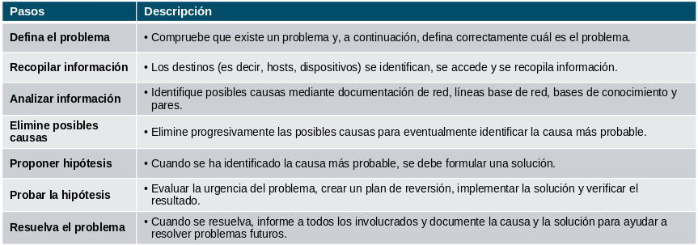
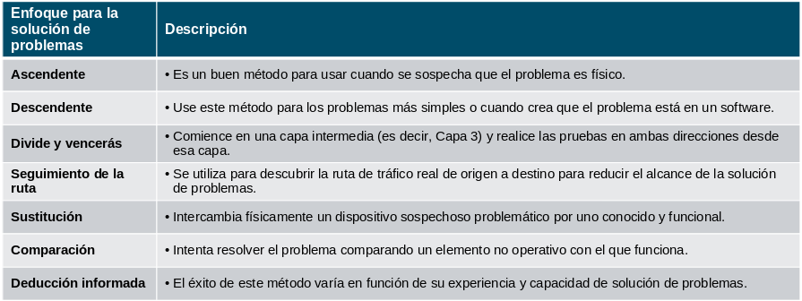

# Resolución de problemas de red

## Documentación de red

### Descripción general de la documentación

Se requiere documentación de red precisa y completa para supervisar y solucionar problemas de redes de manera eficaz.

La documentación de red común incluye lo siguiente:

- Diagramas lógicos y físicos de topología de la red
- Documentación de dispositivos de red que registra toda la información pertinente del dispositivo
- Documentación de referencia del rendimiento de la red

Toda la documentación de la red debe mantenerse en una sola ubicación y la documentación de copia de seguridad debe mantenerse y mantenerse en una ubicación separada.

###  Establecer una línea de base de red

Una línea de base de red se utiliza para establecer el rendimiento normal de la red con el fin de determinar la «personalidad» de una red en condiciones normales. Para establecer una línea de base de rendimiento de la red, es necesario reunir datos sobre el rendimiento de los puertos y los dispositivos que son esenciales para el funcionamiento de la red.

Los datos de referencia son los siguientes:

- Proporcionar información sobre si el diseño actual de la red puede satisfacer los requisitos comerciales. 
- Puede revelar áreas de congestión o áreas de la red que están infrautilizadas.

### Medición de datos

Al documentar la red, con frecuencia es necesario reunir información directamente de los routers y los switches. Los comandos obvios y útiles para la documentación de red incluyen ping, traceroute, y telnet, así como los siguientes comandos show.

La tabla detalla algunos de los comandos más comunes de Cisco IOS para la recopilación de datos.
Leyenda de la tabla

| Comando                        | Descripción                                                                                                                                |
| :----------------------------- | :----------------------------------------------------------------------------------------------------------------------------------------- |
| show version                   | Muestra el tiempo de actividad, información sobre la versión del software y del hardware del dispositivo.                                  |
| show ip/ipv6 interface [brief] | Muestra todas las opciones de configuración establecidas en una interfaz.                                                                  |
| show interfaces                | Muestra la salida detallada de cada interfaz.                                                                                              |
| show ip/ipv6 route             | La tabla de routing consta de redes conectadas directamente y redes remotas aprendidas.                                                    |
| show cdp neighbors detail      | Muestre información detallada acerca del dispositivo Cisco conectado directamente.                                                         |
| show arp / show ipv6 neighbors | Muestra el contenido de la tabla ARP (IPv4) y la tabla de vecinos (IPv6).                                                                  |
| show running-config            | Muestre la configuración actual.                                                                                                           |
| show vlan                      | Muestra el estado de las VLAN en un switch.                                                                                                |
| show port                      | Muestra el estado de los puertos en un switch.                                                                                             |
| show tech-support              | Se utiliza para recopilar una gran cantidad de información utilizando varios comandos show para propósitos de informes de soporte técnico. |

## Proceso de solución de problemas

### Procedimientos generales de solución de problemas

La solución de problemas puede llevar mucho tiempo porque las redes difieren, los problemas difieren y la experiencia de solución de problemas varía. 

El uso de un método estructurado de solución de problemas acortará el tiempo general de solución de problemas.

Existen varios procesos de solución de problemas que se pueden usar para resolver un problema. 

### Proceso de siete pasos para la solución de problemas

### Métodos estructurados para la solución de problemas

 