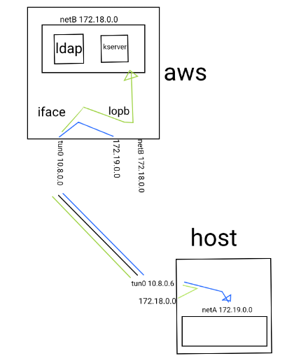

# OpenVpn

puerto 1194

```bash
/usr/lib/systemd/system/openvpn@.service
/usr/lib/tmpfiles.d/openvpn.conf
...
/usr/share/doc/openvpn/sample/sample-keys

[jorge@pc03 ~]$ tree /etc/openvpn/


➜  ~ ll /usr/share/doc/openvpn/examples/sample-keys 
total 84K
-rw-r--r-- 1 root root 2,2K feb 20  2019 ca.crt
-rw-r--r-- 1 root root 3,3K feb 20  2019 client.crt.gz
-rw-r--r-- 1 root root 1,7K feb 20  2019 client.key
-rw-r--r-- 1 root root  424 feb 20  2019 dh2048.pem
-rw-r--r-- 1 root root 3,5K feb 20  2019 server.crt.gz
-rw-r--r-- 1 root root 1,7K feb 20  2019 server.key
...

➜  ~ ll /usr/share/doc/openvpn/examples/sample-config-files 
total 68K
-rw-r--r-- 1 root root 3,6K feb 20  2019 client.conf
-rw-r--r-- 1 root root 4,3K feb 20  2019 server.conf.gz
...
```


## Ejemplos Comand line

### túnel simple sin cifrar.

```bash
➜  ~ sudo openvpn --remote  portatil --dev tun1 --ifconfig 10.4.0.2 10.4.0.1 --verb 9
[jorge@pc03 ~]$ sudo openvpn --remote  torre --dev tun1 --ifconfig 10.4.0.1 10.4.0.2 --verb 9


13: tun1: <POINTOPOINT,MULTICAST,NOARP,UP,LOWER_UP> mtu 1500 qdisc fq_codel state UNKNOWN group default qlen 100
    link/none 
    inet 10.4.0.1 peer 10.4.0.2/32 scope global tun1
       valid_lft forever preferred_lft forever
    inet6 fe80::591a:b249:b1bf:89d8/64 scope link stable-privacy 
       valid_lft forever preferred_lft forever
       
[jorge@pc03 ~]$ curl 10.4.0.2:13
23 MAR 2020 09:07:36 UTC
```


### túnel host a host clave compertida

```bash
➜  ~ sudo openvpn --genkey --secret key
➜  ~ sudo scp key jorge@portatil:

[jorge@pc03 ~]$ ls -l key 
-rw-------. 1 jorge jorge 636 mar 23 10:25 key

➜  ~ sudo openvpn --remote  portatil --dev tun1 --ifconfig 10.4.0.2 10.4.0.1 --verb 5 --secret key

[jorge@pc03 ~]$ sudo openvpn --remote  torre --dev tun1 --ifconfig 10.4.0.1 10.4.0.2 --verb 5 --secret key

[jorge@pc03 ~]$ curl 10.4.0.2:13
23 MAR 2020 09:26:57 UTC
```


### host to host tls public/secret key

En este casi se utiliza el host torre de server y el host portatil de cliente, las claves utilizadas son las proporcionadas por openvpn de ejemplo, nunca utilizarlas en producción.

```bash
➜  ~ cd /usr/share/doc/openvpn/examples/sample-keys/                               
➜  ~ sudo cp dh2048.pem ca.crt client.key client.crt.gz server.crt.gz server.key /home/debian/

➜  ~ scp ca.crt client.* jorge@portatil:

➜  ~ sudo openvpn --remote  portatil --dev tun1 --ifconfig 10.4.0.2 10.4.0.1 --verb 5 --tls-server --dh dh2048.pem --ca ca.crt --cert server.crt --key server.key --reneg-sec 60 --verb 5

[jorge@pc03 ~]$ sudo openvpn --remote  torre --dev tun1 --ifconfig 10.4.0.1 10.4.0.2  --tls-client --ca ca.crt --cert client.crt --key client.key --reneg-sec 60 --verb 5 

[jorge@pc03 ~]$ curl 10.4.0.2:13
23 MAR 2020 09:56:29 UTC
```


### túnel network to network

básicamente es enrrutar la subred creada por un tunel a un gateway externo

```bash
may ➜  ~ sudo echo 1 | tee /proc/sys/net/ipv4/ip_forward
june ➜  ~ sudo echo 1 | tee /proc/sys/net/ipv4/ip_forward

may ➜  ~ iptables −A FORWARD −i tun+ −j ACCEPT
june ➜  ~ iptables −A FORWARD −i tun+ −j ACCEPT

may ➜  ~ route add −net 10.0.1.0 netmask 255.255.255.0 gw 10.4.0.2
june ➜  ~ route add −net 10.0.0.0 netmask 255.255.255.0 gw 10.4.0.1
```

Esquema:

```
    may                         june
    10.4.0.1   route adds       10.4.0.2
     +-----+  <-----------+  +----+
     |     |                 |    |
     +-----+  +---------->   v----+
        ||                     | |
        ||                     | |
        || OpenS 10.0.1.1      | |  OpenS 10.0.0.1
        || tunel               | |  tunel
        || OpenC 10.0.1.2      | |  OpenC 10.0.0.2
      +-----+                +----+
      |     |                |    |
      +-----+                +----+ 
```


## Server multiuser

Configuración para un servidor, que puede albergar múltiples usuarios con las mismas llaves.

### Dominio

El dominio que trae por defecto lo modifico a mi gusto, para simplificar su utilización.

```bash
[fedora@aws ~]$ sudo cp /lib/systemd/system/openvpn-server@.service /etc/systemd/system/.

[fedora@aws ~]$ cat /etc/systemd/system/openvpn-server@.service 
[Unit]
Description=OpenVPN service for %I hisx
After=syslog.target network-online.target

[Service]
Type=forking
PrivateTmp=true
ExecStartPre=/usr/bin/echo serveri %i %I
PIDFile=/var/run/openvpn-server/%i.pid
ExecStart=/usr/sbin/openvpn --daemon --writepid /var/run/openvpn-server/%i.pid --cd /etc/openvpn/ --config %i.conf

[Install]
WantedBy=multi-user.target
```

### Configuración

Configuración del servidor

```bash
[fedora@aws ~]$ cp /usr/share/doc/openvpn/sample/sample-config-files/server.conf .
[fedora@aws ~]$ sudo cp server.conf /etc/openvpn/hisxserver.conf
[fedora@aws ~]$ cat /etc/openvpn/hisxserver.conf 

port 1194
proto udp
dev tun

ca /etc/openvpn/keys/ca.crt
cert /etc/openvpn/keys/server.crt
key /etc/openvpn/keys/server.key  # This file should be kept secret
dh /etc/openvpn/keys/dh2048.pem

server 10.8.0.0 255.255.255.0
ifconfig-pool-persist ipp.txt
client-to-client
;duplicate-cn

keepalive 10 120
cipher AES-256-CBC
comp-lzo

persist-key
persist-tun

status openvpn-status.log
verb 3
explicit-exit-notify 1
```


### llaves

En este paso se tienen que generar unas claves o utilizar ( solo en entornos de pruebas ) las llaves por defecto existentes en `/usr/share/doc/openvpn/sample/sample-key`  ( No vienen en todas las distribuciones o versiones de las mismas )

```bash
[fedora@aws ~]$ tree /etc/openvpn/
/etc/openvpn/
|-- client [error opening dir]
|-- hisxserver.conf
|-- ipp.txt
|-- keys
|   |-- ca.crt
|   |-- dh2048.pem
|   |-- server.crt
|   `-- server.key
|-- openvpn-status.log
`-- server [error opening dir]
```


Para acabar recargo los dominios, ya que lo hemos modificado manualmente y enciendo el server.

```bash
[fedora@aws ~]$ sudo systemctl daemon-reload 
[fedora@aws ~]$ sudo systemctl start openvpn-server@hisxserver.service
```

**Compruebo** que se a creado una nueva interfaz con la red indicada en el dispositivo `tun0`

```bash
[fedora@ip-172-31-82-34 ~]$ ip a s tun0
3: tun0: <POINTOPOINT,MULTICAST,NOARP,UP,LOWER_UP> mtu 1500 qdisc fq_codel state UNKNOWN group default qlen 100
    link/none 
    inet 10.8.0.1 peer 10.8.0.2/32 scope global tun0
       valid_lft forever preferred_lft forever
    inet6 fe80::20c:58c8:3152:2900/64 scope link stable-privacy 
       valid_lft forever preferred_lft forever
```


## Host cliente

### Configuración

Copio y modifico la configuración de ejemplo proporcionada por openvpn.

```bash
➜  ~ sudo cp /usr/share/doc/openvpn/examples/sample-config-files/client.conf /etc/openvpn/client/hisxclient.conf

➜  ~ sudo cat /etc/openvpn/client/hisxclient.conf

client
dev tun
proto udp

# remote server port
remote aws 1194

resolv-retry infinite
nobind
persist-key
persist-tun

ca /etc/openvpn/keys/ca.crt
cert  /etc/openvpn/keys/client.crt
key  /etc/openvpn/keys/client.key

remote-cert-tls server
cipher AES-256-CBC
comp-lzo
verb 3
```

### llaves

Estas llaves las he extraído del servidor ( estoy utilizando las de por defecto ), todos los clientes tendrán las mismas.

```bash
➜  ~ sudo cp ca.crt client.crt client.key /etc/openvpn/keys
➜  ~ sudo chmod 600 /etc/openvpn/keys/*

[sudo] password for jorge: 
/etc/openvpn/
├── client
│   └── hisxclient.conf
├── keys
│   ├── ca.crt
│   ├── client.crt
│   ├── client.key
│   └── dh2048.pem
└── server
```


Como es un entorno de pruebas y no tengo resolución al servidor, asigno la resolución en `/etc/hosts` manualmente.

```bash
➜  ~ cat /etc/hosts
127.0.0.1	localhost
127.0.1.1	localhost.localdomain	localhost

# The following lines are desirable for IPv6 capable hosts
::1     localhost ip6-localhost ip6-loopback
ff02::1 ip6-allnodes
ff02::2 ip6-allrouters
3.84.58.174 aws
```

Enciendo el **dominio** del cliente por defecto con la configuración `hisxclient`

```bash
➜  ~ sudo systemctl start openvpn-client@hisxclient 
```

Compruebo que conecta y crea la nueva interficie `tun0`

```bash
➜  ~ ip a s tun0
10: tun0: <POINTOPOINT,MULTICAST,NOARP,UP,LOWER_UP> mtu 1500 qdisc pfifo_fast state UNKNOWN group default qlen 100
    link/none 
    inet 10.8.0.6 peer 10.8.0.5/32 scope global tun0
       valid_lft forever preferred_lft forever
    inet6 fe80::ae4:71c6:32ce:c922/64 scope link stable-privacy 
       valid_lft forever preferred_lft forever
```


## Conectividad entre redes

Teniendo el servidor y cliente en marcha, en este paso se conecta la red `netB` en la ami de amazon con el host local y la red `netA` del host local con la ami de amazon.




```bash
# enciendo dockers ldap y kserver en aws con la red 'netB  172.18.0.0'
[fedora@aws ~]$ sudo docker run --rm --name ldap.edt.org -h ldap.edt.org --net netB -d jorgepastorr/ldapserver19:final
[fedora@aws ~]$ sudo docker run --rm --name kserver.edt.org -h kserver.edt.org --net netB -d jorgepastorr/k19:kserver

# enciendo docker local con red 'netA  172.19.0.0'
➜  ~ docker run --rm --name nethost -h nethost  --net netA -d jorgepastorr/net19:nethost

# desde local enruto todo el trafico de la red 172.18.0.0/16 hacia el tunel vpn 10.8.0.6
# la red 172.18.0.0 no tiene que existir en local
# 10.8.0.6 es la ip local del tunel vpn
➜  ~ sudo ip route add 172.18.0.0/16 via 10.8.0.6     
➜  ~ ip route show                               
default via 192.168.88.1 dev enp3s0 proto dhcp metric 100 
10.8.0.0/24 via 10.8.0.5 dev tun0 
10.8.0.5 dev tun0 proto kernel scope link src 10.8.0.6 
172.17.0.0/16 dev docker0 proto kernel scope link src 172.17.0.1 linkdown 
172.18.0.0/16 via 10.8.0.6 dev tun0 
172.19.0.0/16 dev br-2d7ff7224245 proto kernel scope link src 172.19.0.1 

# permito pc local enrutar y abro peticiones del tunel vpn
➜  ~ echo 1 |sudo  tee /proc/sys/net/ipv4/ip_forward
➜  ~ sudo iptables -A FORWARD -i tun+ -j ACCEPT

# desde aws enruto todo el trafico de la red 172.19.0.0/16 hacia el tunel vpn 10.8.0.2
# la red 172.19.0.0 no tiene que existir en aws
[fedora@aws ~]$ sudo ip route add 172.19.0.0/16 via 10.8.0.2
[fedora@aws ~]$ sudo ip r
default via 172.31.80.1 dev eth0 proto dhcp metric 100 
10.8.0.0/24 via 10.8.0.2 dev tun0 
10.8.0.2 dev tun0 proto kernel scope link src 10.8.0.1 
172.17.0.0/16 dev docker0 proto kernel scope link src 172.17.0.1 linkdown 
172.18.0.0/16 dev br-9202ac48a79d proto kernel scope link src 172.18.0.1 
172.19.0.0/16 via 10.8.0.2 dev tun0 
172.31.80.0/20 dev eth0 proto kernel scope link src 172.31.92.8 metric 100 

# permito aws enrutar y abro peticiones del tunel vpn
[fedora@aws ~]$ echo 1 | sudo tee /proc/sys/net/ipv4/ip_forward
[fedora@aws ~]$ sudo iptables -A FORWARD -i tun+ -j ACCEPT

# Compuebo
# desde local puedo acceder a la base de datos ldap desde el enrtamiento echo de 172.18.0.0 pasando por el tunel vpn y acabando en aws.
➜  ~ ldapsearch -x -LLL -h 172.18.0.2:389 -b 'dc=edt,dc=org' dn

# desde docker local lo mismo con kserver
➜  ~ docker run --net netA --rm -it jorgepastorr/k19:khost

[root@5b295dee370e docker]# cat /etc/hosts
127.0.0.1	localhost
172.19.0.3	5b295dee370e
172.18.0.3 kserver.edt.org kserver

[root@5b295dee370e docker]# kinit pere
Password for pere@EDT.ORG: 

[root@5b295dee370e docker]# klist
Ticket cache: FILE:/tmp/krb5cc_0
Default principal: pere@EDT.ORG

Valid starting     Expires            Service principal
03/24/20 20:11:30  03/25/20 20:11:30  krbtgt/EDT.ORG@EDT.ORG
```

